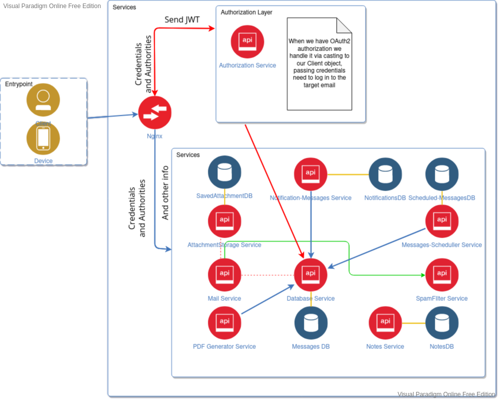

# Postal 

----
### Project description
> This is  simple Mail WebClient Backend, which you can access via 
> mobile device or web browser. For the best speed performance it divided by microservices
> 
----

### Technology stack
1. Spring Boot 2.7
2. Spring Data
3. Lombok
4. PostgreSQL
5. Mockito
6. JUnit
7. Docker
8. Nginx
9. Hibernate
10. Hibernate Search
11. Maven Build System

----

### Future features
1. Swagger
2. Kubernetes
3. Prometheus/Grafana
4. Interaction of GRPC services

----
### Installation steps
```console 
foo@bar:~$ cd /config/deployment 
foo@bar:~$ ./deployment.sh
```

---- 
### Diagram

